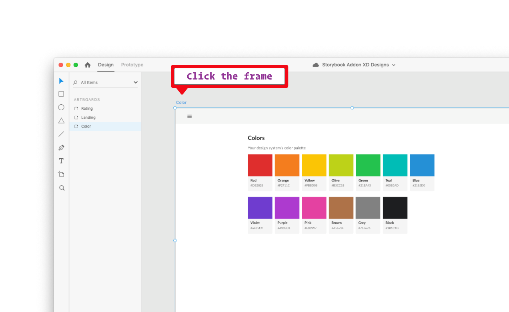
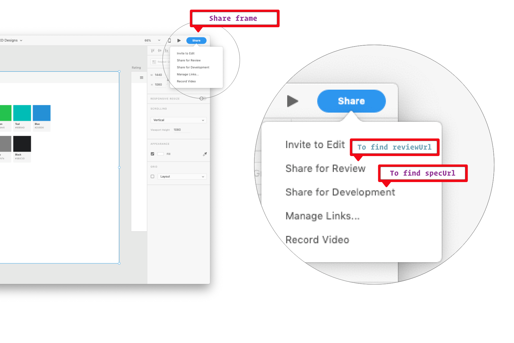
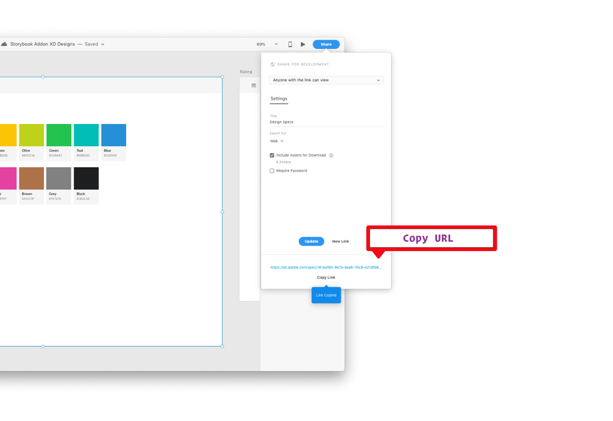

<div align="center">
  
[](https://badge.fury.io/js/storybook-addon-xd-designs)
[](https://www.npmjs.com/package/storybook-addon-xd-designs)
[](https://github.com/pocka/storybook-addon-xd-designs/blob/master/LICENSE)
[](https://github.com/prettier/prettier)

</div>

<hr/>

# storybook-addon-xd-designs

A storybook addon that embeds 
Adobe XD specs in your addon panel for better design-development workflow.

- [Demo](https://morgs32.github.io/storybook-addon-xd-designs)

## Credit
- Forked from https://github.com/pocka/storybook-addon-designs

## Requirements

- [storybook](https://github.com/storybooks/storybook)@>=5.0.0

This addon should work well with any framework.
If not, open an issue.

## Getting started

1. Install
    ```sh
    npm install --save-dev storybook-addon-xd-designs
    ```
    or 
    ```sh
    yarn add -D storybook-addon-xd-designs
    ```
    Make sure you have these peer dependencies installed:
    - `@storybook/addons` 
    - `@storybook/components`
    - `@storybook/theming`
    
2. Register the addon in `addons.js`
    ```js
    // .storybook/addons.js
    
    import 'storybook-addon-xd-designs/register'
    ```
3. Add it to story!
    ```js
    import { withXD } from 'storybook-addon-xd-designs'
    
    storiesOf('My stories', module)
      .addDecorator(withXD)
      .add('My awesome story', () => <Button>Hello, World!</Button>, {
        design: {
          specUrl: 'https://xd.adobe.com/spec/181eaf80-9e7a-4ea6-7dc8-e21dfd9b2d80-6e2f/screen/58270c9e-502b-4737-be32-a5dfe9523bb5/Color/',
          reviewUrl: 'https://xd.adobe.com/view/813cbece-c467-47ce-67e3-b60caacc2ff8-f70d/',
        }
      })
    ```
    How to find your `specUrl` and `reviewUrl`:
    1. 
    1. 
    1. 

## Usage

Add `withXD` decorator then put `design` parameter after your story.

> NOTE: If you omit `design` parameter, the addon does nothing.

## Similar projects

- [storybook-addon-designs](https://github.com/pocka/storybook-addon-designs)
